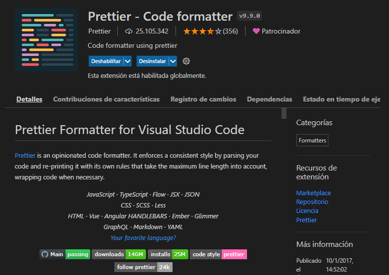
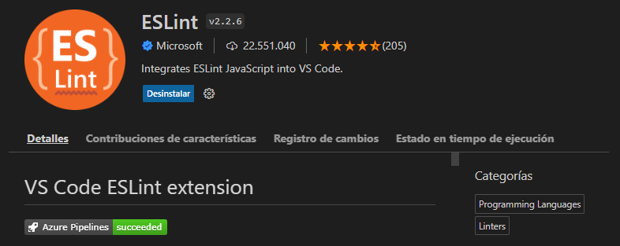
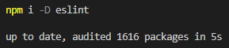
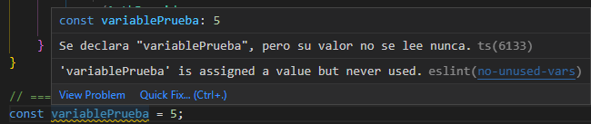
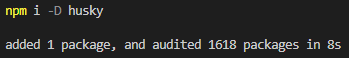
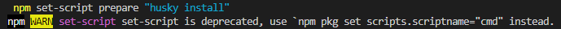
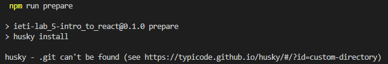
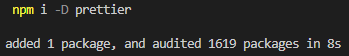
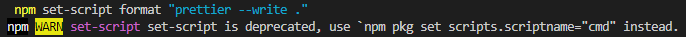
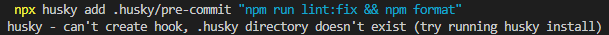

# Laboratorio 7: Buenas prácticas de Código

## Inovación y Emprendimiento con Tecnologías de Información

#### Camilo Andrés Pichimata Cárdenas

##### Septiembre del 2022

## Desarrollo

Para el desarrollo de este laboratorio se trabajó sobre una nueva rama llamada [`Lab_7`](https://github.com/CamiloPichimata/IETI-Lab_6-Hooks-React_Router/tree/Lab_7) en el laboratorio 6

### Parte 1: VSCode

1. Se realizó la instalación del plugin **_Prettier_** en _VSCode_



2. Se realizó la instalación del plugin **_Eslint_** en _VSCode_



### Parte 2: Eslint

1. Se abrió el archivo **[package.json](https://github.com/CamiloPichimata/IETI-Lab_6-Hooks-React_Router/blob/master/WebApplication/package.json)**, nos dirigimos a `eslintConfig`, en donde encontramos lo siguiente:

```json
  "eslintConfig": {
    "extends": [
      "react-app",
      "react-app/jest"
    ]
  },
```

Modificamos hasta obtener lo siguiente y guardamos

```json
  "eslintConfig": {
    "extends": [
      "eslint:recommended",
      "react-app",
      "react-app/jest",
      "prettier"
    ]
  },
```

2. Ejecutamos el comando `npm i -D eslint` desde el directorio raiz de la aplicación.



3. Agregamos las siguientes líneas al archivo **[package.json](https://github.com/CamiloPichimata/IETI-Lab_6-Hooks-React_Router/blob/master/WebApplication/package.json)** en `scripts`

```json
"lint": "eslint --ext .js,.jsx .",
"lint:fix": "npm run lint -- --fix"
```

Obtenemos lo siguiente:

```json
  "scripts": {
    "start": "react-scripts start",
    "build": "react-scripts build",
    "test": "react-scripts test",
    "eject": "react-scripts eject",
    "lint": "eslint --ext .js,.jsx .",
    "lint:fix": "npm run lint -- --fix"
  },
```

4. Se ha completado la instalación y configuración del complemento, si todo sale bien al poner el puntero del mouse sobre algún error o marca de error en el editor, se debe visualizar un mensaje por parte de **_eslint_**, en este caso se agregó una variable que no ha sido usada en ningún lado, se puede observar el siguiente mensaje por parte de **_eslint_**:



### Parte 3: Prettier

1. Se agregón una nueva llave llamada `"prettier"` abajo de `eslintConfig` como se puede ver a continuación:

```json
  ...
  "eslintConfig": {
    "extends": [
      ...
    ]
  },
  "prettier": {
  },
  "browserslist": {
    ...
```

2. Nos dirigimos a **_file/preferences/settings_** y en la configuración de usuarios (Users) vamos a **_Text Editor / Formatting_**; Allí damos clic en el checkbox **Format On Save** como se puede ver a continuación:


### Parte 4: Husky

Corremos los siguientes comandos desde la dirección raiz de la aplicación:

```
npm i -D husky
```



```
npm set-script prepare "husky install"
```



```
npm run prepare
```



```
npm i -D prettier
```



```
npm set-script format "prettier --write ."
```



```
npx husky add .husky/pre-commit "npm run lint:fix && npm format"
```



Ahora cada vez que se intente realizar un commit, entes de que este se lleve a cabo, se valida que no hayan errores de **eslint** y se formatearán los archivos del proyecto usando la configuración de **prettier**.
